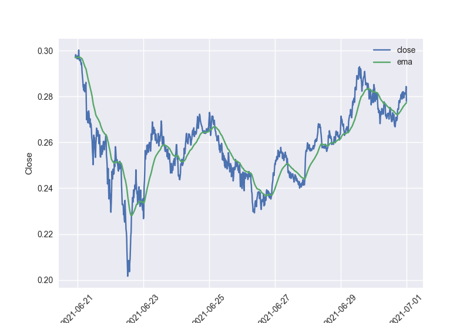
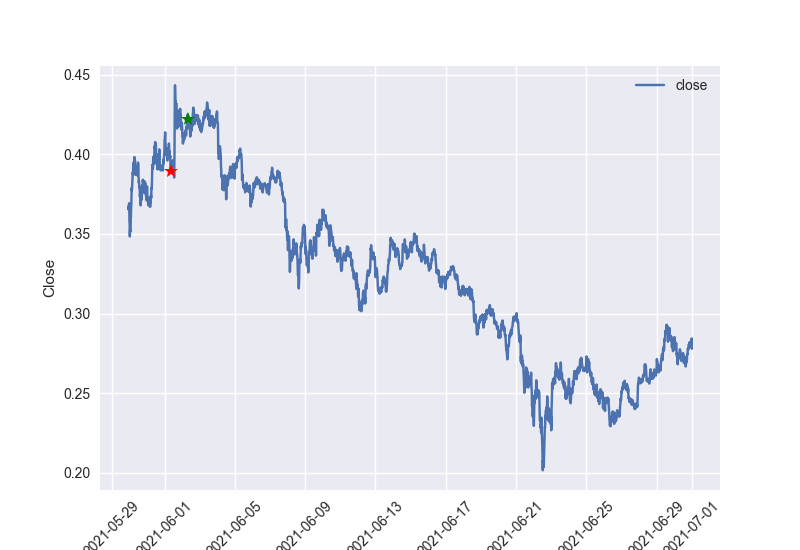

# Yakbee 

## About
Yakbee is yet another crypto-currency trading bot. It can trade in an arbitrary number of markets with a unique
 configuration for each market. When I set out to build this bot my goal was to build it as modular 
as possible so that adding new signals and strategies did not require change to the core code.

If you find this project useful, have a question, or a suggestion on how to make it better [let me hear about it.](mailto:jason@jasongregory.us).

## Prerequisites
- Python 3.7 - <https://installpython3.com>
- Pip3 - <https://pip.pypa.io>

## Other Requirements

In order to run the bot you'll need an account on a crypto-currency exchange. Currently the only exchange
supported by the bot is [CoinbasePro](https://pro.coinbase.com/). You can sign up for a an account for free. You should be able
to run in simulation or test mode without depositing any money.

The bot will trade with all available funds. CoinbasePro offers the ability to create portfolios. You can deposit individual
amounts of money per portfolio and run the bot for a particular coin within that portfolio.

For example, you might have multiple portfolios in coinbase:
- BTC-USD with $100 to trade BTC
- DOGE-USD with $10 to trade DOGE
- XLM-USD with $10 to trade XLM
- etc.

Each api key you generate will be associated with a portfolio and can only access the funds
in that portfolio. Therefore, each trader will have a separate api key/secret which is how the bot
trades in a particular portfolio.

## Installation
    % git clone https://github.com/jasgrg/yakbee.git
    % cd yakbee
    % pip3 install -r requirements.txt
    
##### Alternate installation for raspberry pi
If you want to run yakbee on a raspberry pi you might need to install the dependency a bit differently.

    % git clone https://github.com/jasgrg/yakbee.git
    % sudo apt-get install python3-pandas python3-matplotlib
    % pip3 install requests python-telegram-bot
 
## Configuration

The configuration for yakbee is found in a <code>config.json</code> file in the root directory of the project. This file
This file is not in source control so before running yakbee you'll need to create it.

##### Sample <code>config.json</code>

    {
        "traders": [
            {
                "name": "BTC-USD on coinbase pro",
                "alias": "BTC",
                "live" : 0,
                "exchange": "coinbasepro",
                "auth": {
                    "api_url": "https://api.pro.coinbase.com",
                    "api_key": "<removed>",
                    "api_secret": "<removed>",
                    "api_passphrase": "<removed>"
                },
                "config" : {
                    "base_currency" : "BTC",
                    "quote_currency" : "USD",
                    "granularity" : 300,
                    "sell_at_loss": 0,
                    "buy_near_high": 0,
                    "min_gain_to_sell": 0.2,
                    "buy_strategies": [
                        ["exponential_moving_average", "moving_average_crossover"],
                        ["exponential_moving_average_crossover", "moving_average"]],
                    "sell_strategies": [
                        ["exponential_moving_average", "moving_average_crossover"],
                        ["exponential_moving_average_crossover", "moving_average"]]
                }
            }
        ],

        "sim": {
              "simulation": true,
              "sim_start_date": "2021-06-24 00:00:00",
              "sim_end_date": "2021-06-27 00:00:00",
              "data_file": "datasets/btc_ytd_300.csv"
        },
        "telegram": {
            "token": "<removed>",
            "client_id": "<removed>"
        },
        "log": {
            "loglevel": "INFO"
        }
    }

#### Configuration Breakdown

The <code>traders</code> section is the only required section in the configuration. <code>Traders</code> specifies a 
list of markets you want the bot to trade in and the configuration associated with each market.

- <code>name</code> Just for logging to specify what trader is emitting the log entries.
- <code>alias</code> *optional*: used to identify trader for notifications.
- <code>live</code> 0 means the bot will run in simulation mode and perform theoretical trades. 1 means the bot will 
trade with live funds.
- <code>exchange</code> specifies what online exchange to use. Current options are <code>coinbasepro</code> only.
- <code>auth</code> authorization properties specific to the specified exchange.
- Trader specific configuration:
  - <code>base_currency</code> the desired base currency to trade.
  - <code>quote_currency</code> the desired quote currency to trade. The combination of base currency and quote currency 
  are what define the "market".
  - <code>granularity</code> most (*all* at the current time) trading signals will look at the base currency's price at
  at a specified granularity (1m, 5m, 15m, 1hr, etc) to determine trading actions. These intervals are usually graphically
  represented as [candlesticks](https://www.investopedia.com/trading/candlestick-charting-what-is-it/).
  - <code>sellatloss</code> *optional: defaults to 1*, when <code>0</code> the bot will not execute a sell if the current value is less than the
  previous purchase value. This can be good or bad depending on your strategy. Sometimes a short term loss can result in a long
  term gain, but not always. Trade with care. 
  - <code>buy_near_high</code> *optional: defaults to 0* when 0 the bot will not perform a buy if the price is greater
  than 97% of the recent max close price.
  - <code>min_gain_to_sell</code> *optional: defaults to 0* when <code>sellatloss</code> is True this setting has no effect.
  Otherwise the bot will not sell if the current price is less than the previous buy price plus the mimimum percentage gain.
  - <code>buy_strategies</code> is a two-dimensional array of strings. Each child array is a strategy. Each string within 
  the strategy represents a signal. During the trading cycle the bot will consult each strategy on whether it determines
  a buy action or a sell action. If *any* strategy returns a buy action then a buy will be executed. In order for a strategy
  to return a buy action, *all* of the signals must return a buy action.
  - <code>sell_strategies</code> if not strategies return a buy action, then the sell strategies are consulted. If *any*
  sell strategy returns a sell action then a sell is executed. In order for a strategy to return a sell action, *all* of the 
  signals within the strategy must return a sell signal.

## How it works

##### Trade manager

At the top level is the <code>trade_manager</code>. The trade manager holds a list of <code>traders</code>.
Every 5 seconds the trademanager will loop through the list of traders and have them check 
whether to trade or not and if so to execute the trade. Each trader only takes action if it has been *x* seconds
since the last time it took action, where *x* is the granularity specified for the trader.

##### Traders

When it is time for the trader to take action, it begins by looping through the <code>buy_strategies</code>.
If any of the buy strategies returns a *buy* action then the traders buys as much of the base currency
as it has funds available to use. 

If none of the buy strategies return a buy action then the trader will check the sell strategies.
If any of the sell strategies returns a sell action then the trader will sell all of the base currency
currently being held. If <code>sell_at_loss</code> is 0 then the trader will check the current price of the base currency.
If the current price is less than the last purchase price the trader will not sell.

##### Strategy

A strategy is simply a list of signals. For the strategy to take action, all of the signals must agree on the action to 
be taken.

##### Signals

A <code>signal</code> is a piece of code that looks at the history of the base currency and casts a vote to the strategy
whether to buy, sell or wait.

#### Technical Analysis

[Technical Analysis](https://www.investopedia.com/terms/t/technicalanalysis.asp) is the act of "evaluating investments and identifying trade opportunities."

To learn more about various signals employed in technical anaylsis see [here](https://www.investopedia.com/articles/technical/112601.asp).

Yakbee currently supports the following list of signals. Each signal is not a very good trade indicator by itself but is 
meant to be combined with other signals to form a strategy. This is what makes Yakbee so unique in that the signals can be
arbitrarily combined in a way that best supports your trading style and goals.

Available signals:

- <code>moving_average</code> : Returns BUY/SELL if the short term simple moving average (sma) is above/under the long term sma.
- <code>moving_average_crossover</code> : Returns BUY/SELL if the short term sma crossed 
over/under the long term sma in the previous interval.
- <code>moving_average_slope</code> : Returns BUY/SELL  if the [rate of change](https://www.investopedia.com/terms/p/pricerateofchange.asp) 
of the short term sma is positive/negative.
- <code>exponential_moving_average</code> : Returns BUY/SELL if the short term exponential moving average (ema) is above/under the long term ema.
- <code>exponential_moving_average_crossover</code> : Returns BUY/SELL if the short term ema crossed 
over/under the long term ema in the previous interval.
- <code>exponential_moving_average_slope</code> : Returns BUY/SELL  if the [rate of change](https://www.investopedia.com/terms/p/pricerateofchange.asp) 
of the short term ema is positive/negative.
- <code>macd</code> : [Moving average convergence divergence](https://www.investopedia.com/terms/m/macd.asp)
- <code>three_black_crows</code>: [description](https://www.investopedia.com/terms/t/three_black_crows.asp)
- <code>three_white_solders</code>: [description](https://www.investopedia.com/terms/t/three_white_soldiers.asp)

<strong>Don't see a signal here you want to use? Consider contributing or enter a feature request.</strong>

## Simulation Mode

If a <code>sim</code> element is provided in the configuration and the <code>simulation</code> element is set to True 
then the all of the traders will run in simulation mode.

The simulation runs through the historical data for each trader from start date to end date and records all theoretical trades for the time period.

This is a good way to validate different trading strategies over historical data.

Settings available in the <code>sim</code> configuration element.

- <code>simulation</code> sets simulation mode on/off
- <code>start_date</code> start date of simulation
- <code>end_date</code> end date of simulation
- <code>data_file</code> *optional* csv data to be used instead of retrieving data from the exchange. This is helpful
for running the simulation over a lot of data multiple times (to test different strategies). If this element is not 
provided then the bot retrieves the historical data from the exchange.

## Graphs

After each trading interval the bot will render a set of graphs to the <code>graphs</code> directory.

For each trader a graph will be rendered for each signal as well as a graph of the most recent trades. On 
the trades graph a red star indicates where a sell trade was made and a green start indicates where a buy trade
was made.

## Examples

Charting the exponential moving average which can be used as a buy/sell signal:

This graph shows the bot buying but not selling at a loss. The downside of this strategy is that sometimes
a small loss could result in gains later.

## Execution

##### Yakbee bot

    % python3 yakbee.py
    
##### Script to chart historical orders

    % python3 orders_charter.py
    
## Receive Notifications

Currently the only notification service avialable in yakbee is to use telegram.

##### Telegram setup

- Install [Telegram](https://telegram.org/apps)
- Open the [Telegram Bot](https://telegram.me/BotFather)
- Send the message <code>/newbot</code> to BotFather
    - Follow the prompts to create your bot
    - You should receive an API Token, this token goes into your config.json
- Send a message to your newly created bot. This starts a conversation and makes the chat_id available.
- Open <code>https://api.telegram.org/bot{token}/getUpdates</code>. This will show a json document
with recent updates.  In the <code>chat</code> section you'll see an id that is your <code>client_id</code>. Paste
the client id into the config.json file.

Now whenever yakbee issues a trade it will send a notification to telegram along with the recent trade graphs.

You can send messages to your bot:

    % /g <alias>
    
The bot will send all the graphs generated by the trader with the given alias.

    % /t
    
The bot will send all recent trade graphs.